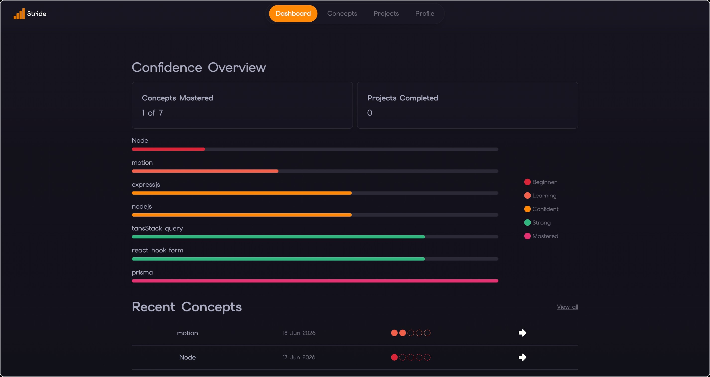

# Stride

Built for self-taught devs who want to prove — to themselves — that they're growing.

Track what you learn, what you build, and how far you've come — so your progress is impossible to ignore.

**[Try Stride →](https://stridedev.dev)**

## About

Most people learning web development feel like they don't belong. Or get overwhelmed by how much there is to learn. I've been there.

Without a computer science degree, starting from scratch can leave you feeling lost halfway through your journey. Stride was built for that exact problem.

There are plenty of skill trackers out there — but none aimed at web developers, and especially not at the ones constantly fighting impostor syndrome. Stride helps self-taught web devs track their journey, see their growth, and build confidence by recording projects and rating the concepts they used along the way.

## Features

- **Concepts** — Add, edit, and delete concepts with an initial confidence rating (Beginner → Mastered)
- **Notes per concept** — Capture insights as you learn
- **Projects** — Add, edit, delete, and change project status (Not Started → In Progress → Completed)
- **Lessons learnt per project** - Capture lessons learnt on completion of a project
- **Inline concept creation** — Create concepts on the fly while adding a project, or in bulk from the concepts overview page
- **Confidence dashboard** with:
  - Projects completed and concepts mastered at a glance
  - Rating chart of all concepts
  - Recently added concepts table
  - Recently added projects
- **Rating history chart per concept** — See how your confidence in each concept has grown over time
- **Authentication** — Sign up, log in, password reset, email verification

## Tech Stack

**Frontend Foundation**

- React (Vite)
- TypeScript
- Tailwind CSS

**State & Data**

- TanStack Query
- React Hook Form
- Zod
- Axios

**Routing & UX**

- React Router
- Framer Motion
- Recharts
- react-loader-spinner
- react-hot-toast
- lucide-react

**Monitoring**

- Sentry

The backend API lives in a [separate repo](https://github.com/alsheha88/stride-backend).